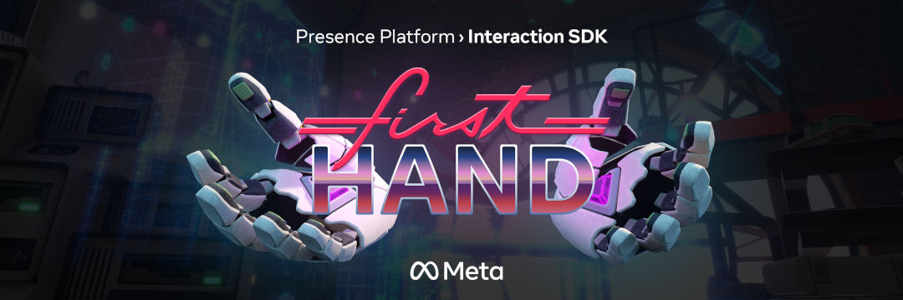

# First Hand

First Hand is an example of a full game experience using *[Interaction SDK](https://developer.oculus.com/documentation/unity/unity-isdk-interaction-sdk-overview/)* for interactions. It is designed to be used with hand tracking. This Unity project contains the interactable elements from the full First Hand experience, presented without the gameplay or progression of the full app.

# AppLab
You can find the full version of the First Hand app on AppLab:

https://www.oculus.com/experiences/quest/5030224183773255/

## Licenses
The *Oculus Integration* package is released under the *[Oculus SDK License Agreement](https://developer.oculus.com/licenses/oculussdk)*.
The MIT licence applies to the files and assets in the Assets/Project folder.
Otherwise, if an individual file does not indicate which license it is subject to, then the Oculus License applies.

## Getting started

First, ensure you have Git LFS installed by running this command:
```sh
git lfs install
```

Then, clone this repo using the "Code" button above, or this command:
```sh
git clone https://github.com/oculus-samples/Unity-FirstHand.git
```

All of the actual project files are in Assets/Project. This folder includes all scripts and assets to run the sample, excluding those that are part of the Interaction SDK.
The project includes v41 of the Oculus SDK, including the Interaction SDK. You can find the Interaction SDK in [Assets/Oculus/Interaction]{Assets/Oculus/Interaction).

To run the sample, open the project folder in *Unity 2020.3.33f1* or newer and load the [Assets/Project/Scenes/Clocktower](Assets/Scenes/Clocktower.unity) scene.

## Interactions
The project contains several interactable objects that showcase different interactations implementated with the Interaction SDK.

*Lift Control* - Demonstrates "Hand Grab" and "Poke" interactions.

*Keypad* - Demonstrates "Poke" interactions.

*Glove Schematic Pieces* - Demonstrates "Hand Grab" with "Two Grab Free Transformer" interactions.

*Glove Pieces* - Demonstrates "Touch Grab" interactions.

*Schematic UI* - Demonstrates "Poke" interactions with a Unity canvas.

*Distance Grab Toggle* - Demonstrates "Distance Grab" interactions.

*Blast and Shield Toggle* - Demonstrates "Pose Detection" functionality.

For more information on these interactions please reference the *[Interaction SDK documentation](https://developer.oculus.com/documentation/unity/unity-isdk-interaction-sdk-overview/)*
